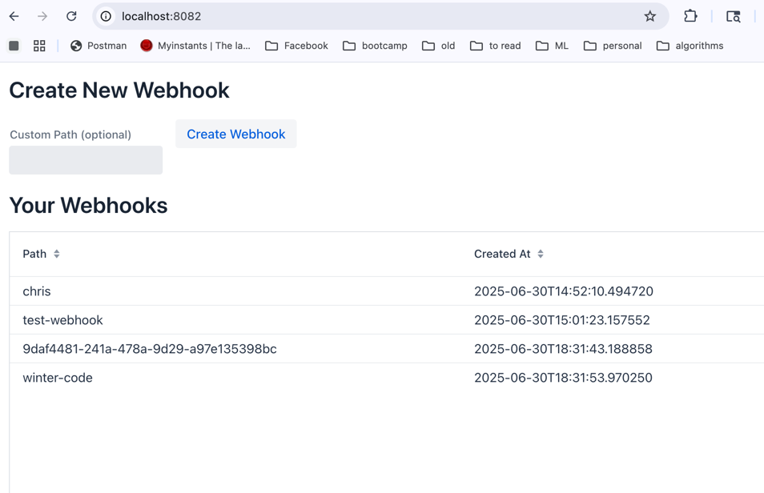
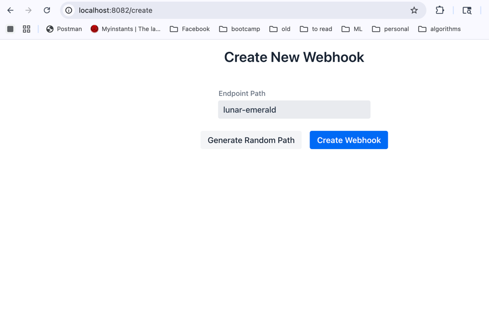
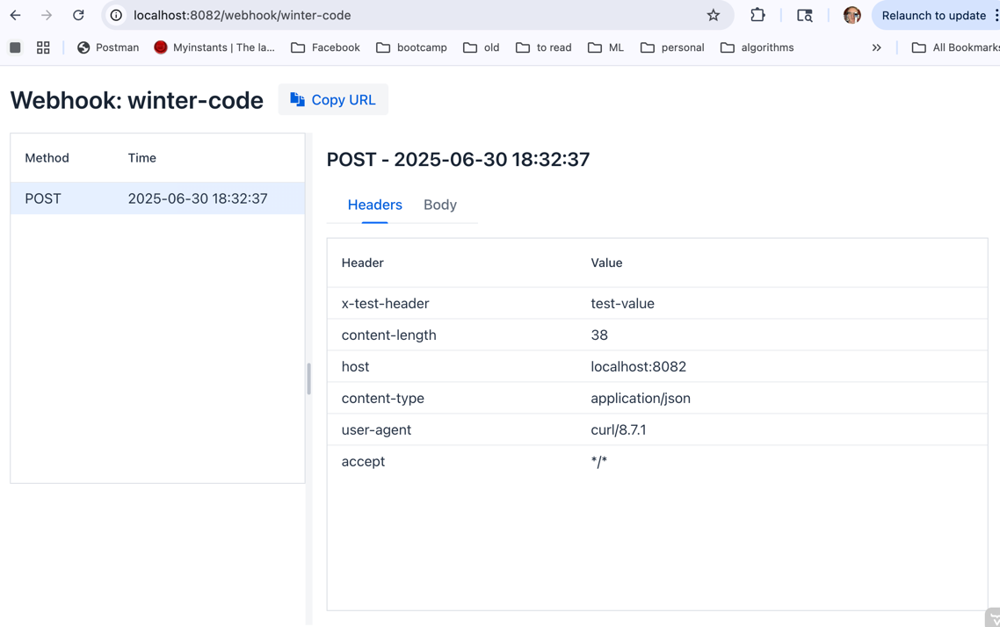
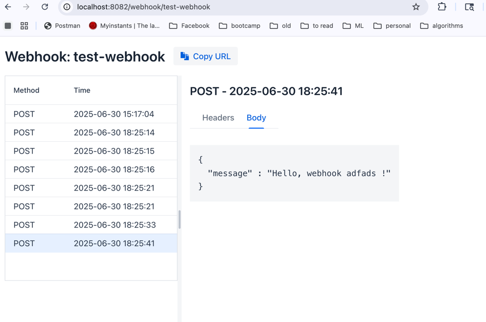

# WebhookSite

WebhookSite is a self-hosted webhook testing service similar to webhooks.site. It allows you to create webhook endpoints and inspect incoming HTTP requests in real-time through a modern web interface.

## Features

- Create custom webhook endpoints or use auto-generated ones
- Real-time request inspection with WebSocket updates
- View request details including headers, body, and source information
- Pretty-print JSON payloads
- Persistent storage of webhook requests
- Modern, responsive UI built with Vaadin

## Tech Stack

- Backend: Spring Boot
- Frontend: Vaadin Flow
- Database: PostgreSQL
- Containerization: Docker
- Orchestration: Kubernetes

## Prerequisites

- Java 21 or later
- Docker
- Kubernetes cluster (local like minikube/kind/k3d or remote)
- kubectl configured to access your cluster

## Building and Running Locally

### Using Docker Compose

1. Build and start the application:
   ```bash
   ./mvnw clean package -Pproduction
   docker compose up -d
   ```

2. Access the application at http://localhost:8083

### Using Kubernetes

1. Deploy the application:
   ```bash
   ./deploy.sh
   ```

2. Access the application at http://localhost:8083

To clean up Kubernetes resources:
```bash
./cleanup.sh
```

## Application Structure

- `src/main/java/com/example/webhooksite/`
  - `controller/` - REST endpoints for webhook handling
  - `model/` - JPA entities
  - `repository/` - Spring Data JPA repositories
  - `service/` - Business logic
  - `ui/` - Vaadin views and components

## Usage

1. Create a Webhook:
   - Visit the home page
   - Click "Create Webhook"
   - Optionally specify a custom path or let the system generate one
   - Copy the webhook URL

2. Send Requests:
   - Use the webhook URL with any HTTP method (GET, POST, PUT, etc.)
   - Send any headers and body content

3. View Requests:
   - Click on a webhook in the list
   - See requests in real-time in the left panel
   - View detailed request information in the right panel
   - Headers and body are displayed in separate tabs
   - JSON bodies are automatically pretty-printed

## Development

### Development Mode

For local development:
```bash
./mvnw spring-boot:run
```

The application will start in development mode with H2 database.

### Production Build

For production deployment:
```bash
./mvnw clean package -Pproduction
```

This builds the application with:
- Optimized frontend resources
- PostgreSQL configuration
- Production-ready settings

## Container Images

The application uses multi-stage Docker builds:
1. Build stage with JDK and Node.js for compilation and frontend build
2. Runtime stage with JRE only for minimal image size

## Kubernetes Deployment

The Kubernetes deployment includes:
- ConfigMap for application properties
- Secret for database credentials
- StatefulSet for PostgreSQL database
- Deployment for the application
- LoadBalancer Service for external access

### Configuration

- Database configuration in `k8s/configmap.yaml`
- Credentials in `k8s/secret.yaml`
- Database settings in `k8s/postgres.yaml`
- Application deployment in `k8s/app.yaml`

## License

This project is open source and available under the MIT License.

# Webhook Site

A Spring Boot application similar to webhooks.site that allows you to create custom webhook endpoints and inspect incoming webhook requests. The application provides a Vaadin-based UI for creating and managing webhook endpoints, and viewing the received webhook payloads.

## System Design

### Architecture

The application is built using:
- Spring Boot 3.2.2
- Vaadin Flow 24.3.3 for the UI
- H2 Database for persistence
- JPA/Hibernate for data access

### Components

1. **Data Models**:
   - `Webhook`: Represents a webhook endpoint with a unique path
   - `WebhookRequest`: Stores webhook request details including headers and payload

2. **Core Components**:
   - `WebhookService`: Manages webhook creation and request handling
   - `WebhookRepository`: JPA repository for data persistence
   - `WebhookController`: REST controller for handling incoming webhook requests
   - `MainView`: Lists all webhook endpoints
   - `CreateWebhookView`: UI for creating new webhook endpoints
   - `WebhookDetailsView`: Split-panel view for inspecting webhook requests

### Database Schema

The application uses three main tables:
- `webhook`: Stores webhook endpoints
- `webhook_request`: Stores webhook requests
- `webhook_request_headers`: Stores headers for each webhook request

## Building and Running

### Prerequisites

- Java 21 or later
- Maven 3.8 or later

### Build

```bash
./mvnw clean install
```

### Run

```bash
./mvnw spring-boot:run
```

The application will be available at:
- Web UI: http://localhost:8082
- H2 Console: http://localhost:8082/h2-console (if needed)

The default page lists the current webhooks:

## Usage

### Creating a Webhook

1. Open http://localhost:8082/create in your browser
2. Enter a custom path or click "Generate Random Path" for a word-pair based path (e.g., "cat-magnet")
3. Click "Create Webhook"
4. The webhook URL will be displayed and can be copied to clipboard

An example:


### Sending Webhook Requests

You can send webhook requests to your endpoint using any HTTP method. The base URL format is:
```
http://localhost:8082/api/webhook/{webhook-path}
```

#### Example Requests

1. Simple POST request:
```bash
curl -X POST "http://localhost:8082/api/webhook/test-webhook" \
  -H "Content-Type: application/json" \
  -d '{"message": "Hello, webhook!"}'
```

2. Request with custom headers:
```bash
curl -X POST "http://localhost:8082/api/webhook/test-webhook" \
  -H "Content-Type: application/json" \
  -H "X-Custom-Header: custom-value" \
  -H "Authorization: Bearer test-token" \
  -d '{"event": "user.created", "data": {"id": 123, "name": "Test User"}}'
```

3. Different HTTP methods:
```bash
# GET request
curl -X GET "http://localhost:8082/api/webhook/test-webhook?param=value"

# PUT request
curl -X PUT "http://localhost:8082/api/webhook/test-webhook" \
  -H "Content-Type: application/json" \
  -d '{"status": "updated"}'

# DELETE request
curl -X DELETE "http://localhost:8082/api/webhook/test-webhook"
```

### Viewing Webhook Requests

1. All webhook endpoints are listed on the main page
2. Click on a webhook to navigate to its details page (http://localhost:8082/webhook/your-path)
3. The details page shows:
   - Left panel: List of all requests with method and timestamp
   - Right panel: Detailed view of the selected request
     - Request method and timestamp
     - Headers tab: All request headers in a grid view
     - Body tab: Pretty-printed JSON if valid, raw text otherwise
4. Real-time updates:
   - New requests appear automatically in the left panel
   - Notification shown when new requests arrive
   - Latest request is automatically selected

An example:


and of the request body:

## Features

- Create webhook endpoints with custom or word-pair based paths
- Support for all HTTP methods
- Modern split-panel interface for request inspection
- Pretty-printing of JSON payloads
- Real-time UI updates using Vaadin Push
- Copy webhook URL to clipboard
- Persistent storage using H2 database
- Separate pages for endpoint creation and request inspection

## Technical Notes

- The application uses an H2 file-based database located at `./webhookdb`
- Request bodies are stored with a maximum length of 10,000 characters
- CORS is enabled for all origins to allow testing from any domain
- The application runs in development mode by default

## Limitations

- No authentication/authorization
- No request payload validation
- Limited to single instance deployment (no load balancing)
- Request body size limited to 10,000 characters
